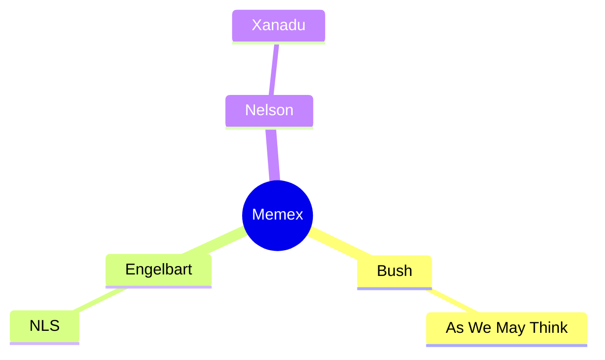

# awiki Plan — Phase 14: Synth Lint + Remaining Plugins

> **For agentic workers:** REQUIRED SUB-SKILL: Use superpowers:subagent-driven-development (recommended) or superpowers:executing-plans to implement this plan task-by-task. Steps use checkbox (`- [ ]`) syntax for tracking.

**Spec:** [`2026-04-27-synthesis-generator-design.md`](../specs/2026-04-27-synthesis-generator-design.md)
**Master:** [`2026-04-27-awiki-master-plan.md`](./2026-04-27-awiki-master-plan.md)
**Depends on:** Phase 13 (synth core, plugin loader, briefing plugin, fixture wiki)
**Previous:** [Phase 13](./2026-04-27-phase-13-synth-core.md)
**Next:** [Phase 15](./2026-04-27-phase-15-synth-refinement-mcp.md)

**Tech stack:** bash 4+, just 1.13+, hugo 0.120+ extended, hugo-book theme, qmd (qntx-labs fork), git-crypt 0.7+, age 1.0+, bats-core 1.10+, python3 3.8+ (`difflib` stdlib), Node 20+ (phase 8 only), `@mermaid-js/mermaid-cli` (`mmdc`) optional.

**Conventions:**
- Scripts: `#!/usr/bin/env bash`, `set -euo pipefail`.
- All shell-outs use argv arrays; positional args terminated with `--`. No `python3 -c '...'` with interpolated user content (forbidden — see S3 threat model).
- Slug regex: `^[a-z0-9][a-z0-9-]*$` (no leading hyphen, no flag-injection).
- `ALLOW_PLUGIN_POST_HOOKS=0` is the default; `synth.sh` refuses to run any `post.sh`/post-hook script unless flipped to `1`.
- Lint output: one `LINT|<level>|<file>|S<n>: <msg>` per finding; final `LINT-SUMMARY|errors=N|warnings=M|info=K` carried over from existing `scripts/lint.sh`.
- S6 keys off frontmatter `last_updated`, NOT filesystem mtime.
- Commit after every task. Conventional Commits (`feat:`, `fix:`, `docs:`, `test:`, `chore:`).
- TDD where applicable: failing fixture+test → run → implement → run → commit. One S<n> rule = one task with its own test.
- Branch per phase. Merge to main only after `just test && just lint` are clean.

---

**Deliverable:** `scripts/lint-synth.sh` (rules S1-S6, S9), `scripts/lint-synth-fuzzy.py` (separate-file fuzzy helper), `mindmap` / `timeline` / `study-guide` plugins, `scripts/synth-mindmap-validate.sh` post-hook, `--only=synth` flag on `lint.sh` (with `--file=<path>` single-file form), `--fix` for synth (S3 normalization steps 2/3/4 inside generated regions only), `ALLOW_PLUGIN_POST_HOOKS=0` flag in `.awiki/config` + post-hook gate in `synth.sh`, BATS test suite covering S1-S6/S9 plus the three plugins' scaffolds plus the mermaid post-hook, and WIKI.md Section 4 sub-workflow expanded with lint discipline + the remaining three plugins (Section 7 lint checklist gains S1-S6 and S9; S7-S8 deferred to phase 15).

**Branch:** `phase-14-synth-lint-plugins`

---

## Task 14.1: Branch + `ALLOW_PLUGIN_POST_HOOKS` config gate

**Files:** Modify: `.awiki/config`, `scripts/synth.sh`. Create: (none).

- [ ] **Step 1: Branch**

```bash
git checkout -b phase-14-synth-lint-plugins
```

Expected output:

```
Switched to a new branch 'phase-14-synth-lint-plugins'
```

- [ ] **Step 2: Add `ALLOW_PLUGIN_POST_HOOKS=0` to `.awiki/config`**

Open `.awiki/config` and append (after the existing `AWIKI_LOG_QUERIES=0` line from phase 2):

```
# Plugin post-hooks are arbitrary shell code shipped inside synthesis-plugins/*/.
# Default off. Flip to 1 only after reviewing the post.sh of every directory-form
# plugin you have installed. Single-file plugins (briefing, mindmap, timeline,
# study-guide as shipped by awiki) are prompt-only and ignore this flag —
# only directory-form plugins with post.sh are gated. The mindmap mermaid
# validator (scripts/synth-mindmap-validate.sh) is shipped by awiki itself
# and is also gated by this flag (it only runs when the flag is 1).
ALLOW_PLUGIN_POST_HOOKS=0
```

- [ ] **Step 3: Add the post-hook gate function to `scripts/synth.sh`**

Locate the section in `scripts/synth.sh` (shipped by phase 13) where plugin post-hooks would be invoked — the `finalize` and `accept-stage` paths after the lint pass. Insert this helper near the top of the script (after the `source .awiki/config` line):

```bash
# Post-hook gate. Returns 0 if the hook is allowed to run, 1 if blocked.
# Callers must check the return code and skip invocation on block.
synth_post_hooks_allowed() {
  if [[ "${ALLOW_PLUGIN_POST_HOOKS:-0}" = "1" ]]; then
    return 0
  fi
  echo "SYNTH|post-hook-blocked|ALLOW_PLUGIN_POST_HOOKS=0; set to 1 in .awiki/config to enable" >&2
  return 1
}
```

Then in the existing finalize/accept-stage post-lint section, wrap any `post_hook` invocation:

```bash
# Existing block (phase 13) — replace the bare invocation:
if [[ -n "${PLUGIN_POST_HOOK:-}" && -x "$PLUGIN_POST_HOOK" ]]; then
  if synth_post_hooks_allowed; then
    if ! "$PLUGIN_POST_HOOK" -- "$TARGET_PATH"; then
      echo "SYNTH|post-hook-failed|$PLUGIN_POST_HOOK exit non-zero" >&2
      exit 6
    fi
  fi
fi
```

Note `--` before the positional path argument and the absence of any shell-string interpolation of `$TARGET_PATH` into a hook command.

- [ ] **Step 4: Add a smoke test for the gate**

Append to `tests/synth_test.bats` (created in phase 13):

```bash
@test "synth post-hook is skipped when ALLOW_PLUGIN_POST_HOOKS=0" {
  # Fixture mindmap synthesis page with a post_hook configured.
  # The hook (a stub) writes a sentinel file; absence of the sentinel
  # confirms the hook was not invoked.
  setup_mindmap_fixture
  rm -f "$WORK/.awiki/post-hook-ran"
  AWIKI_REPO_ROOT="$WORK" ALLOW_PLUGIN_POST_HOOKS=0 \
    bash scripts/synth.sh finalize -- mindmap-fixture
  [ ! -f "$WORK/.awiki/post-hook-ran" ]
}

@test "synth post-hook runs when ALLOW_PLUGIN_POST_HOOKS=1" {
  setup_mindmap_fixture
  rm -f "$WORK/.awiki/post-hook-ran"
  AWIKI_REPO_ROOT="$WORK" ALLOW_PLUGIN_POST_HOOKS=1 \
    bash scripts/synth.sh finalize -- mindmap-fixture
  [ -f "$WORK/.awiki/post-hook-ran" ]
}
```

`setup_mindmap_fixture` is a helper added in task 14.13 (mermaid-post-hook task) — these two assertions piggyback on that fixture. Mark them `skip` for now if the fixture isn't yet defined; they go green at task 14.13.

- [ ] **Step 5: Commit**

```bash
git add .awiki/config scripts/synth.sh tests/synth_test.bats
git commit -m "feat: add ALLOW_PLUGIN_POST_HOOKS gate to synth.sh post-hook invocation"
```

Expected output:

```
[phase-14-synth-lint-plugins ...] feat: add ALLOW_PLUGIN_POST_HOOKS gate to synth.sh post-hook invocation
 3 files changed, ...
```

---

## Task 14.2: `scripts/lint-synth-fuzzy.py` — separate-file fuzzy helper

**Files:** Create: `scripts/lint-synth-fuzzy.py`, `tests/fixtures/wiki-synth/fuzzy-source.md`, `tests/lint_synth_fuzzy_test.bats`.

This helper exists *only* as a separate file. The S3 lint rule MUST invoke it as `python3 scripts/lint-synth-fuzzy.py <source-path> <quote-tmpfile>`. **Building any `python3 -c '...'` invocation that interpolates source text is a security bug** (sources are user-supplied PDFs/web clippings; adversarial content there becomes RCE if `-c` is used).

- [ ] **Step 1: Write the failing BATS test**

```bash
cat > tests/lint_synth_fuzzy_test.bats <<'EOF'
#!/usr/bin/env bats

setup() {
  TMP="$(mktemp -d)"
  cat > "$TMP/source.md" <<'SRC'
---
title: "Sample"
type: source
---

Knowledge work in 1945 hinged on a researcher's ability to traverse
their own associative trails through stored sources.

The memex would compress decades of literature into a desk-sized device.
SRC

  cat > "$TMP/quote.txt" <<'QUOTE'
knowledge work in 1945 hinged on a researchers ability
QUOTE
}

teardown() { rm -rf "$TMP"; }

@test "fuzzy helper finds closest paragraph" {
  run python3 scripts/lint-synth-fuzzy.py "$TMP/source.md" "$TMP/quote.txt"
  [ "$status" -eq 0 ]
  [[ "$output" == *"associative trails"* ]] || [[ "$output" == *"researcher"* ]]
}

@test "fuzzy helper exits 0 with empty stdout when no close match" {
  printf "completely unrelated alien text xyzzy\n" > "$TMP/quote.txt"
  run python3 scripts/lint-synth-fuzzy.py "$TMP/source.md" "$TMP/quote.txt"
  [ "$status" -eq 0 ]
}

@test "fuzzy helper rejects missing source file" {
  run python3 scripts/lint-synth-fuzzy.py "$TMP/nope.md" "$TMP/quote.txt"
  [ "$status" -ne 0 ]
}

@test "fuzzy helper does not interpret quote content as code" {
  # Quote contains characters that would be hostile in a python -c context.
  printf '"; import os; os.system("touch /tmp/awiki-pwn-%s") #' "$$" > "$TMP/quote.txt"
  rm -f /tmp/awiki-pwn-$$
  run python3 scripts/lint-synth-fuzzy.py "$TMP/source.md" "$TMP/quote.txt"
  [ "$status" -eq 0 ]
  [ ! -f /tmp/awiki-pwn-$$ ]
}
EOF
```

- [ ] **Step 2: Run test (expect FAIL — script absent)**

```bash
bats tests/lint_synth_fuzzy_test.bats
```

Expected output:

```
 ✗ fuzzy helper finds closest paragraph
   ... python3: can't open file '.../scripts/lint-synth-fuzzy.py'
4 tests, 4 failures
```

- [ ] **Step 3: Write `scripts/lint-synth-fuzzy.py`**

```bash
cat > scripts/lint-synth-fuzzy.py <<'EOF'
#!/usr/bin/env python3
"""S3 fuzzy-match helper.

Reads a source file (markdown) and a quote file. Splits the source into
paragraphs, applies the same normalization the shell-side lint applies,
runs difflib.get_close_matches against the normalized quote, and prints
the top match (raw paragraph form) to stdout.

Inputs are file paths only. Source bodies are user-supplied (PDFs, web
clippings) and may contain adversarial content; therefore source text
NEVER appears in argv or in a -c expression. The shell side calls this
file as: python3 scripts/lint-synth-fuzzy.py <source-path> <quote-path>
"""

from __future__ import annotations

import re
import sys
import unicodedata
from difflib import get_close_matches
from pathlib import Path

ZERO_WIDTH = "\u200b\u200c\u200d\ufeff\u200e\u200f\u202a\u202b\u202c\u202d\u202e"
HYPHENS = {"\u2010": "-", "\u2011": "-", "\u2012": "-", "\u2013": "-", "\u2014": "-"}
SMART_QUOTES = {"\u201c": '"', "\u201d": '"', "\u2018": "'", "\u2019": "'"}


def normalize(text: str) -> str:
    text = unicodedata.normalize("NFC", text)
    text = text.translate(str.maketrans("", "", ZERO_WIDTH))
    for src, dst in HYPHENS.items():
        text = text.replace(src, dst)
    for src, dst in SMART_QUOTES.items():
        text = text.replace(src, dst)
    text = text.replace("\u00a0", " ")
    text = re.sub(r"\s+", " ", text).strip()
    return text


def strip_frontmatter(text: str) -> str:
    if not text.startswith("---\n"):
        return text
    end = text.find("\n---\n", 4)
    if end == -1:
        return text
    return text[end + len("\n---\n"):]


def split_paragraphs(text: str) -> list[str]:
    return [p.strip() for p in re.split(r"\n\s*\n", text) if p.strip()]


def main(argv: list[str]) -> int:
    if len(argv) != 3:
        print("usage: lint-synth-fuzzy.py <source-path> <quote-path>", file=sys.stderr)
        return 2

    source_path = Path(argv[1])
    quote_path = Path(argv[2])

    if not source_path.is_file():
        print(f"source not found: {source_path}", file=sys.stderr)
        return 1
    if not quote_path.is_file():
        print(f"quote not found: {quote_path}", file=sys.stderr)
        return 1

    source = strip_frontmatter(source_path.read_text(encoding="utf-8", errors="replace"))
    quote = quote_path.read_text(encoding="utf-8", errors="replace")

    paragraphs = split_paragraphs(source)
    if not paragraphs:
        return 0

    norm_quote = normalize(quote)
    norm_paragraphs = [normalize(p) for p in paragraphs]

    matches = get_close_matches(norm_quote, norm_paragraphs, n=1, cutoff=0.55)
    if not matches:
        return 0

    idx = norm_paragraphs.index(matches[0])
    suggestion = paragraphs[idx]
    if len(suggestion) > 200:
        suggestion = suggestion[:200].rsplit(" ", 1)[0] + "..."
    print(suggestion)
    return 0


if __name__ == "__main__":
    sys.exit(main(sys.argv))
EOF
chmod +x scripts/lint-synth-fuzzy.py
```

- [ ] **Step 4: Run test (expect PASS)**

```bash
bats tests/lint_synth_fuzzy_test.bats
```

Expected: `4 tests, 0 failures`.

- [ ] **Step 5: Commit**

```bash
git add scripts/lint-synth-fuzzy.py tests/lint_synth_fuzzy_test.bats
git commit -m "feat: add S3 fuzzy-match helper as standalone python script (anti-injection)"
```

---

## Task 14.3: `scripts/lint-synth.sh` skeleton + S1 marker integrity

**Files:** Create: `scripts/lint-synth.sh`. Modify: `tests/lint_synth_test.bats`. Create fixture: `tests/fixtures/wiki-synth/synthesis/s1-double-begin.md`.

`lint-synth.sh` is **sourced** by `lint.sh` (not exec'd). It defines `synth_lint_file <path>` and `synth_lint_dir <dir>` functions, and contributes its findings to the same `ERRORS` / `WARNS` / `INFOS` counters that `lint.sh` already maintains. This task lays the skeleton plus rule S1.

- [ ] **Step 1: Write the S1 fixture**

```bash
mkdir -p tests/fixtures/wiki-synth/synthesis
cat > tests/fixtures/wiki-synth/synthesis/s1-double-begin.md <<'EOF'
---
title: "S1 Double Begin"
date: 2026-04-27
last_updated: 2026-04-27
last_generated: 2026-04-27T00:00:00Z
type: synthesis
plugin: briefing
scope:
  tag: memex
sources: ["[[s-as-we-may-think]]"]
draft: false
---

Lead paragraph.

<!-- BEGIN GENERATED plugin=briefing scope_hash=a3f9c2 -->

## TL;DR
- claim [[s-as-we-may-think]]

<!-- BEGIN GENERATED plugin=briefing scope_hash=a3f9c2 -->

## Evidence
> "quote" — [[s-as-we-may-think]]

<!-- END GENERATED -->
EOF
```

- [ ] **Step 2: Write the S1 test**

```bash
cat > tests/lint_synth_test.bats <<'EOF'
#!/usr/bin/env bats

# Test wiring:
# - sources lint-synth.sh in a subshell against the fixture wiki under
#   tests/fixtures/wiki-synth/, which phase 13 populated with the
#   memex source set (smart-quote / NBSP / ZWSP / hyphen / multi-paragraph
#   variants per spec).
# - Each test runs `lint.sh --only=synth --file=<path>` once the --only
#   flag is wired in task 14.9; until then, tests source lint-synth.sh
#   directly.

FIXTURES="tests/fixtures/wiki-synth"

run_synth_lint_file() {
  bash -c "
    source scripts/lint-synth.sh
    ERRORS=0; WARNS=0; INFOS=0
    synth_lint_file \"$1\" \"$FIXTURES/content\" 2>&1
    echo LINT-SUMMARY-RC=\$ERRORS
  "
}

@test "S1: double BEGIN marker → error" {
  run run_synth_lint_file "$FIXTURES/synthesis/s1-double-begin.md"
  [[ "$output" == *"LINT|ERROR"*"S1"*"BEGIN"* ]]
  [[ "$output" == *"LINT-SUMMARY-RC=1"* || "$output" == *"LINT-SUMMARY-RC=2"* ]]
}
EOF
```

- [ ] **Step 3: Run test (expect FAIL)**

```bash
bats tests/lint_synth_test.bats
```

Expected: `1 test, 1 failure` (script absent).

- [ ] **Step 4: Write `scripts/lint-synth.sh` with S1**

```bash
cat > scripts/lint-synth.sh <<'EOF'
#!/usr/bin/env bash
# lint-synth.sh — synth-namespaced lint rules. SOURCED by scripts/lint.sh.
# Contributes to ERRORS / WARNS / INFOS counters defined by the caller.
#
# Public entry points:
#   synth_lint_file <synth-page-path> <content-dir>
#   synth_lint_dir <content-dir>
#
# Rules:
#   S1 marker integrity (error)
#   S2 required sections present (error)        — task 14.4
#   S3 evidence quote substring (error)         — task 14.5
#   S4 citation slug in scope (error)           — task 14.6
#   S5 scope drift (warning, skip query-scope)  — task 14.7
#   S6 hand-edit inside markers (warning)       — task 14.8
#   S9 aggregate evidence words (error)         — task 14.10
#
# S7/S8 are deferred to phase 15.

# Guard: only re-source ok if functions already defined.
if declare -F synth_lint_file >/dev/null 2>&1; then
  return 0
fi

# --- S1: marker integrity ----------------------------------------------------
synth_check_s1() {
  local page="$1"
  local begin_count end_count
  begin_count=$(grep -cE '^<!-- BEGIN GENERATED .* -->$' "$page" || true)
  end_count=$(grep -cE '^<!-- END GENERATED -->$' "$page" || true)

  if [[ "$begin_count" -eq 0 ]]; then
    echo "LINT|ERROR|$page|S1: missing BEGIN GENERATED marker"
    ERRORS=$((ERRORS + 1))
    return 1
  fi
  if [[ "$end_count" -eq 0 ]]; then
    echo "LINT|ERROR|$page|S1: missing END GENERATED marker"
    ERRORS=$((ERRORS + 1))
    return 1
  fi
  if [[ "$begin_count" -gt 1 ]]; then
    echo "LINT|ERROR|$page|S1: duplicate BEGIN GENERATED marker (found $begin_count)"
    ERRORS=$((ERRORS + 1))
    return 1
  fi
  if [[ "$end_count" -gt 1 ]]; then
    echo "LINT|ERROR|$page|S1: duplicate END GENERATED marker (found $end_count)"
    ERRORS=$((ERRORS + 1))
    return 1
  fi

  local begin_line end_line
  begin_line=$(grep -nE '^<!-- BEGIN GENERATED .* -->$' "$page" | head -1 | cut -d: -f1)
  end_line=$(grep -nE '^<!-- END GENERATED -->$' "$page" | head -1 | cut -d: -f1)
  if [[ -z "$begin_line" || -z "$end_line" || "$begin_line" -ge "$end_line" ]]; then
    echo "LINT|ERROR|$page|S1: BEGIN must precede END (begin=$begin_line end=$end_line)"
    ERRORS=$((ERRORS + 1))
    return 1
  fi
  return 0
}

# --- entry points ------------------------------------------------------------
# synth_lint_file: lint a single synthesis page. Caller passes the page path
# and the wiki content directory (used by S3/S4 for slug resolution).
synth_lint_file() {
  local page="$1"
  local content_dir="${2:-content}"

  # Only act on files with `type: synthesis` AND `plugin: <name>` frontmatter.
  if ! head -40 "$page" | grep -q '^type: synthesis$'; then
    return 0
  fi
  if ! head -40 "$page" | grep -qE '^plugin: [a-z][a-z0-9-]*$'; then
    return 0
  fi

  synth_check_s1 "$page" || return 0  # bail on broken markers — downstream rules need them
  # synth_check_s2..S9 added in subsequent tasks.
}

synth_lint_dir() {
  local content_dir="${1:-content}"
  local synth_dir="$content_dir/synthesis"
  [[ -d "$synth_dir" ]] || return 0
  while IFS= read -r -d '' page; do
    synth_lint_file "$page" "$content_dir"
  done < <(find "$synth_dir" -maxdepth 2 -name '*.md' -type f -print0)
}
EOF
chmod +x scripts/lint-synth.sh
```

- [ ] **Step 5: Run test (expect PASS)**

```bash
bats tests/lint_synth_test.bats
```

Expected: `1 test, 0 failures`.

- [ ] **Step 6: Commit**

```bash
git add scripts/lint-synth.sh tests/lint_synth_test.bats tests/fixtures/wiki-synth/synthesis/s1-double-begin.md
git commit -m "feat: add lint-synth.sh skeleton with S1 marker-integrity rule"
```

---

## Task 14.4: S2 — required sections present

**Files:** Modify: `scripts/lint-synth.sh`, `tests/lint_synth_test.bats`. Create: `tests/fixtures/wiki-synth/synthesis/s2-missing-evidence.md`.

S2 reads the plugin manifest's `required_sections` list and asserts each heading appears between the BEGIN and END markers.

- [ ] **Step 1: Write the fixture (briefing missing `## Evidence`)**

```bash
cat > tests/fixtures/wiki-synth/synthesis/s2-missing-evidence.md <<'EOF'
---
title: "S2 Missing Evidence"
date: 2026-04-27
last_updated: 2026-04-27
last_generated: 2026-04-27T00:00:00Z
type: synthesis
plugin: briefing
scope:
  tag: memex
sources: ["[[s-as-we-may-think]]"]
draft: false
---

Lead.

<!-- BEGIN GENERATED plugin=briefing scope_hash=a3f9c2 -->

## TL;DR
- claim [[s-as-we-may-think]]

## Key Findings
- finding [[s-as-we-may-think]]

## Open Questions
- question?

<!-- END GENERATED -->
EOF
```

- [ ] **Step 2: Append the test**

```bash
cat >> tests/lint_synth_test.bats <<'EOF'

@test "S2: missing ## Evidence in briefing → error" {
  run run_synth_lint_file "$FIXTURES/synthesis/s2-missing-evidence.md"
  [[ "$output" == *"LINT|ERROR"*"S2"*"Evidence"* ]]
}
EOF
```

- [ ] **Step 3: Run (expect FAIL)**

```bash
bats tests/lint_synth_test.bats -f S2
```

- [ ] **Step 4: Add S2 to `lint-synth.sh`**

Add this function above `synth_lint_file`:

```bash
# --- S2: required sections present ------------------------------------------
# Reads plugin manifest's required_sections list (YAML array, single-file form
# only — directory form not supported in v1) and asserts each heading appears
# between BEGIN and END markers.
synth_get_plugin_required_sections() {
  local plugin="$1"
  local manifest="synthesis-plugins/$plugin.md"
  [[ -f "$manifest" ]] || return 1

  # Extract YAML frontmatter, look for required_sections: list.
  awk '
    /^---$/ { c++; next }
    c==1 && /^required_sections:/ { in_list=1; next }
    c==1 && in_list && /^[a-z_]+:/ { in_list=0 }
    c==1 && in_list && /^[[:space:]]*-[[:space:]]/ {
      sub(/^[[:space:]]*-[[:space:]]*/, "")
      gsub(/^"|"$/, "")
      print
    }
    c>=2 { exit }
  ' "$manifest"
}

synth_check_s2() {
  local page="$1"
  local plugin
  plugin=$(awk '/^plugin: /{print $2; exit}' "$page")
  [[ -n "$plugin" ]] || return 0

  local required
  required=$(synth_get_plugin_required_sections "$plugin") || {
    echo "LINT|ERROR|$page|S2: cannot read manifest for plugin $plugin"
    ERRORS=$((ERRORS + 1))
    return 1
  }
  [[ -n "$required" ]] || return 0

  # Slice between markers.
  local region
  region=$(awk '
    /^<!-- BEGIN GENERATED .* -->$/ { in_region=1; next }
    /^<!-- END GENERATED -->$/      { in_region=0 }
    in_region { print }
  ' "$page")

  while IFS= read -r heading; do
    [[ -z "$heading" ]] && continue
    if ! grep -qxF "$heading" <<<"$region"; then
      echo "LINT|ERROR|$page|S2: required section missing: $heading"
      ERRORS=$((ERRORS + 1))
    fi
  done <<<"$required"
}
```

Then modify `synth_lint_file` body — add `synth_check_s2 "$page"` after the S1 call:

```bash
  synth_check_s1 "$page" || return 0
  synth_check_s2 "$page"
```

- [ ] **Step 5: Run (expect PASS)**

```bash
bats tests/lint_synth_test.bats
```

Expected: 2 tests pass.

- [ ] **Step 6: Commit**

```bash
git add scripts/lint-synth.sh tests/lint_synth_test.bats tests/fixtures/wiki-synth/synthesis/s2-missing-evidence.md
git commit -m "feat(lint-synth): add S2 required-sections rule"
```

---

## Task 14.5: S3 — evidence quote substring (with normalization matrix)

**Files:** Modify: `scripts/lint-synth.sh`, `tests/lint_synth_test.bats`. Create six fixtures under `tests/fixtures/wiki-synth/synthesis/` (one per normalization variant) plus a hallucination fixture. Create a sources fixture if not already shipped by phase 13.

S3 is the anti-hallucination spine. Phase 13 ships `tests/fixtures/wiki-synth/content/sources/s-as-we-may-think.md` with all the normalization variants (smart quotes, NBSP, ZWSP, hyphens, multi-paragraph). Phase 14's job is to write the lint rule and one assertion per variant.

- [ ] **Step 1: Verify phase-13 source fixture has the variants**

```bash
ls tests/fixtures/wiki-synth/content/sources/
grep -l '[\u2014\u2013\u201c\u00a0]' tests/fixtures/wiki-synth/content/sources/*.md || true
```

If phase 13 didn't ship the variants, file a phase-13 bug; do NOT replicate fixture content here. (The spec explicitly assigns the source fixture to phase 13.)

- [ ] **Step 2: Write seven synthesis fixtures (one per assertion)**

Each fixture cites the same source page but quotes it under a different normalization variant. Example for the smart-quote variant:

```bash
cat > tests/fixtures/wiki-synth/synthesis/s3-smart-quote.md <<'EOF'
---
title: "S3 Smart Quote"
date: 2026-04-27
last_updated: 2026-04-27
last_generated: 2026-04-27T00:00:00Z
type: synthesis
plugin: briefing
scope:
  slugs: [s-as-we-may-think]
sources: ["[[s-as-we-may-think]]"]
draft: false
---

Lead.

<!-- BEGIN GENERATED plugin=briefing scope_hash=a3f9c2 -->

## TL;DR
- claim [[s-as-we-may-think]]

## Key Findings
- finding [[s-as-we-may-think]]

## Open Questions
- q?

## Evidence
> "“Consider a future device for individual use”" — [[s-as-we-may-think]]

<!-- END GENERATED -->
EOF
```

Repeat with shape variants — `s3-nfc-vs-nfd.md` (decomposed Unicode in quote, composed in source), `s3-nbsp.md` (quote contains U+00A0 between words), `s3-em-dash.md` (em-dash inside the quote body, not the citation marker), `s3-zwsp.md` (ZWSP injected into source body), `s3-multi-paragraph.md` (quote spans two paragraphs, joined with single space after normalization), and `s3-hallucination.md` (a clearly fake quote that is NOT in the source). The seventh fixture's quote text should be sufficiently close to one source paragraph to trigger a fuzzy suggestion (>= 0.55 similarity). Body content for each fixture follows the smart-quote shape above with the citation line varied.

- [ ] **Step 3: Append seven assertions**

```bash
cat >> tests/lint_synth_test.bats <<'EOF'

@test "S3: smart-quote variant matches after normalization" {
  run run_synth_lint_file "$FIXTURES/synthesis/s3-smart-quote.md"
  [[ "$output" != *"LINT|ERROR"*"S3"* ]]
}

@test "S3: NFC vs NFD variant matches after normalization" {
  run run_synth_lint_file "$FIXTURES/synthesis/s3-nfc-vs-nfd.md"
  [[ "$output" != *"LINT|ERROR"*"S3"* ]]
}

@test "S3: NBSP-spaced quote matches after normalization" {
  run run_synth_lint_file "$FIXTURES/synthesis/s3-nbsp.md"
  [[ "$output" != *"LINT|ERROR"*"S3"* ]]
}

@test "S3: em-dash inside quote body matches after normalization" {
  run run_synth_lint_file "$FIXTURES/synthesis/s3-em-dash.md"
  [[ "$output" != *"LINT|ERROR"*"S3"* ]]
}

@test "S3: ZWSP-injected source matches after normalization" {
  run run_synth_lint_file "$FIXTURES/synthesis/s3-zwsp.md"
  [[ "$output" != *"LINT|ERROR"*"S3"* ]]
}

@test "S3: multi-paragraph quote matches after collapse" {
  run run_synth_lint_file "$FIXTURES/synthesis/s3-multi-paragraph.md"
  [[ "$output" != *"LINT|ERROR"*"S3"* ]]
}

@test "S3: hallucinated quote → error with fuzzy suggestion" {
  run run_synth_lint_file "$FIXTURES/synthesis/s3-hallucination.md"
  [[ "$output" == *"LINT|ERROR"*"S3"*"hallucinat"* || "$output" == *"LINT|ERROR"*"S3"*"not found"* ]]
  [[ "$output" == *"suggestion:"* ]]
}
EOF
```

- [ ] **Step 4: Run (expect FAIL)**

```bash
bats tests/lint_synth_test.bats -f S3
```

- [ ] **Step 5: Implement S3 in `lint-synth.sh`**

Add the python normalization shim — a separate small helper invoked the same way as the fuzzy helper (file paths only, no `-c`), or reuse `lint-synth-fuzzy.py`'s `normalize` function via a `--normalize` mode. To avoid duplicating Unicode logic in bash, use a small dedicated helper:

```bash
cat > scripts/lint-synth-normalize.py <<'EOF'
#!/usr/bin/env python3
"""Apply S3 normalization to a file's contents and write to stdout.

Same normalization function as lint-synth-fuzzy.py. Kept as a separate
script so the shell side can pipe through it without spawning python -c.
"""

from __future__ import annotations
import re
import sys
import unicodedata
from pathlib import Path

ZERO_WIDTH = "\u200b\u200c\u200d\ufeff\u200e\u200f\u202a\u202b\u202c\u202d\u202e"
HYPHENS = {"\u2010": "-", "\u2011": "-", "\u2012": "-", "\u2013": "-", "\u2014": "-"}
SMART_QUOTES = {"\u201c": '"', "\u201d": '"', "\u2018": "'", "\u2019": "'"}


def normalize(text: str) -> str:
    text = unicodedata.normalize("NFC", text)
    text = text.translate(str.maketrans("", "", ZERO_WIDTH))
    for src, dst in HYPHENS.items():
        text = text.replace(src, dst)
    for src, dst in SMART_QUOTES.items():
        text = text.replace(src, dst)
    text = text.replace("\u00a0", " ")
    text = re.sub(r"\s+", " ", text).strip()
    return text


def strip_frontmatter(text: str) -> str:
    if not text.startswith("---\n"):
        return text
    end = text.find("\n---\n", 4)
    if end == -1:
        return text
    return text[end + len("\n---\n"):]


if __name__ == "__main__":
    if len(sys.argv) != 3 or sys.argv[1] not in {"--source", "--quote"}:
        print("usage: lint-synth-normalize.py {--source|--quote} <path>", file=sys.stderr)
        sys.exit(2)
    mode, path = sys.argv[1], Path(sys.argv[2])
    text = path.read_text(encoding="utf-8", errors="replace")
    if mode == "--source":
        text = strip_frontmatter(text)
    sys.stdout.write(normalize(text))
EOF
chmod +x scripts/lint-synth-normalize.py
```

Then add to `lint-synth.sh`:

```bash
# --- S3: evidence quote substring -------------------------------------------
# Resolve a slug to a source path via .awiki/maps/slug-to-path.tsv (built by
# scripts/build.sh + lint.sh from phase 3). Falls back to a content-tree scan
# if the map is missing.
synth_resolve_slug() {
  local slug="$1"
  local map=".awiki/maps/slug-to-path.tsv"
  if [[ -f "$map" ]]; then
    awk -F'\t' -v s="$slug" '$1==s{print $2; exit}' "$map"
    return
  fi
  # fallback: name-based lookup
  find content -type f -name "$slug.md" 2>/dev/null | head -1
}

# Rewrite [[other-slug]] / [[other-slug|disp]] inside a string to its
# frontmatter title. Done inside python for unicode safety; called per-quote.
synth_rewrite_wikilinks_in_quote() {
  local quote="$1"
  python3 - <<PY
import re, sys, pathlib
quote = ${quote@Q}
def title_for(slug):
    map_path = pathlib.Path(".awiki/maps/slug-to-path.tsv")
    if not map_path.is_file():
        return slug
    for line in map_path.read_text().splitlines():
        parts = line.split("\t")
        if len(parts) >= 2 and parts[0] == slug:
            page = pathlib.Path(parts[1])
            if page.is_file():
                for ln in page.read_text().splitlines():
                    if ln.startswith("title:"):
                        t = ln.split(":", 1)[1].strip().strip('"')
                        return t
    return slug
def repl(m):
    raw = m.group(1)
    slug, _, disp = raw.partition("|")
    return disp or title_for(slug)
print(re.sub(r"\[\[([^\]]+)\]\]", repl, quote))
PY
}
```

**Stop — that uses a heredoc with shell-interpolated `${quote@Q}`.** That is safe (`@Q` is shell-side single-quote escaping), but the user's anti-injection rules forbid building any `python3 -` invocation that interpolates user content. Replace with an argv-based helper:

Append a third python helper `scripts/lint-synth-rewrite-wikilinks.py`:

```bash
cat > scripts/lint-synth-rewrite-wikilinks.py <<'EOF'
#!/usr/bin/env python3
"""Read a quote from a file path; rewrite [[slug]] wikilinks to their
frontmatter title (using .awiki/maps/slug-to-path.tsv); write to stdout.
File-path argv only — no interpolation of quote text into argv or -c.
"""

from __future__ import annotations
import pathlib
import re
import sys


def title_for(slug: str) -> str:
    m = pathlib.Path(".awiki/maps/slug-to-path.tsv")
    if not m.is_file():
        return slug
    for line in m.read_text(encoding="utf-8").splitlines():
        parts = line.split("\t")
        if len(parts) >= 2 and parts[0] == slug:
            page = pathlib.Path(parts[1])
            if page.is_file():
                for ln in page.read_text(encoding="utf-8").splitlines():
                    if ln.startswith("title:"):
                        return ln.split(":", 1)[1].strip().strip('"')
    return slug


def main(argv: list[str]) -> int:
    if len(argv) != 2:
        print("usage: lint-synth-rewrite-wikilinks.py <quote-path>", file=sys.stderr)
        return 2
    text = pathlib.Path(argv[1]).read_text(encoding="utf-8", errors="replace")

    def repl(match: re.Match[str]) -> str:
        raw = match.group(1)
        slug, _, disp = raw.partition("|")
        return disp or title_for(slug)

    sys.stdout.write(re.sub(r"\[\[([^\]]+)\]\]", repl, text))
    return 0


if __name__ == "__main__":
    sys.exit(main(sys.argv))
EOF
chmod +x scripts/lint-synth-rewrite-wikilinks.py
```

Then the bash side of S3:

```bash
synth_check_s3() {
  local page="$1"
  local content_dir="${2:-content}"

  # Slice the generated region.
  local region_file
  region_file=$(mktemp)
  awk '
    /^<!-- BEGIN GENERATED .* -->$/ { in_region=1; next }
    /^<!-- END GENERATED -->$/      { in_region=0 }
    in_region { print }
  ' "$page" > "$region_file"

  # Iterate evidence quote lines: > "..." — [[slug]]
  # The em-dash is U+2014 LITERAL — match exactly.
  local line slug quote_raw
  while IFS= read -r line; do
    # Capture the quote body and slug.
    if [[ "$line" =~ ^\>[[:space:]]+\"(.+)\"[[:space:]]+—[[:space:]]+\[\[([a-z0-9][a-z0-9-]*)\]\][[:space:]]*$ ]]; then
      quote_raw="${BASH_REMATCH[1]}"
      slug="${BASH_REMATCH[2]}"
    else
      continue
    fi

    local source_path
    source_path=$(synth_resolve_slug "$slug")
    if [[ -z "$source_path" || ! -f "$source_path" ]]; then
      echo "LINT|ERROR|$page|S3: evidence cites unresolvable slug: $slug"
      ERRORS=$((ERRORS + 1))
      continue
    fi

    # Materialize quote to a tmpfile (no argv text interpolation).
    local quote_tmp rewrite_tmp norm_quote_tmp norm_source_tmp
    quote_tmp=$(mktemp); rewrite_tmp=$(mktemp)
    norm_quote_tmp=$(mktemp); norm_source_tmp=$(mktemp)
    printf '%s' "$quote_raw" > "$quote_tmp"

    # Rewrite [[other-slug]] inside the quote to title text.
    python3 scripts/lint-synth-rewrite-wikilinks.py -- "$quote_tmp" > "$rewrite_tmp"

    # Normalize.
    python3 scripts/lint-synth-normalize.py -- --quote "$rewrite_tmp"  > "$norm_quote_tmp"
    python3 scripts/lint-synth-normalize.py -- --source "$source_path" > "$norm_source_tmp"

    if grep -F -q -f "$norm_quote_tmp" "$norm_source_tmp"; then
      :  # OK
    else
      local suggestion
      suggestion=$(python3 scripts/lint-synth-fuzzy.py -- "$source_path" "$norm_quote_tmp" || true)
      if [[ -n "$suggestion" ]]; then
        echo "LINT|ERROR|$page|S3: evidence quote not found in [[$slug]] (suggestion: $suggestion)"
      else
        echo "LINT|ERROR|$page|S3: evidence quote not found in [[$slug]] (hallucinated or paraphrased; no close match)"
      fi
      ERRORS=$((ERRORS + 1))
    fi

    rm -f "$quote_tmp" "$rewrite_tmp" "$norm_quote_tmp" "$norm_source_tmp"
  done < "$region_file"

  rm -f "$region_file"
}
```

Note: `python3 scripts/lint-synth-fuzzy.py -- "$source_path" "$norm_quote_tmp"` uses the `--` separator before positional argv as required. The fuzzy helper's `argv` parsing tolerates `--` as a no-op (Python's `sys.argv` includes it; update the helper to skip a leading `--` token):

Edit `scripts/lint-synth-fuzzy.py` `main`:

```python
def main(argv: list[str]) -> int:
    args = [a for a in argv[1:] if a != "--"]
    if len(args) != 2:
        print("usage: lint-synth-fuzzy.py <source-path> <quote-path>", file=sys.stderr)
        return 2
    source_path = Path(args[0])
    quote_path = Path(args[1])
    ...
```

Apply the same pattern to `lint-synth-normalize.py` and `lint-synth-rewrite-wikilinks.py`.

Add `synth_check_s3 "$page" "$content_dir"` to `synth_lint_file` after the S2 call.

- [ ] **Step 6: Run (expect PASS for all 7)**

```bash
bats tests/lint_synth_test.bats -f S3
```

- [ ] **Step 7: Commit**

```bash
git add scripts/lint-synth.sh scripts/lint-synth-normalize.py scripts/lint-synth-rewrite-wikilinks.py scripts/lint-synth-fuzzy.py tests/lint_synth_test.bats tests/fixtures/wiki-synth/synthesis/s3-*.md
git commit -m "feat(lint-synth): add S3 evidence-quote substring with full normalization matrix"
```

---

## Task 14.6: S4 — citation slug in scope

**Files:** Modify: `scripts/lint-synth.sh`, `tests/lint_synth_test.bats`. Create: `tests/fixtures/wiki-synth/synthesis/s4-out-of-scope.md`.

S4 verifies every `[[slug]]` inside the generated region resolves AND is one of the resolved slugs for the page's `scope:`. Resolution uses `synth.sh resolve` (phase 13) — the lint shells out to it.

- [ ] **Step 1: Fixture (cites a slug not in scope)**

```bash
cat > tests/fixtures/wiki-synth/synthesis/s4-out-of-scope.md <<'EOF'
---
title: "S4 Out Of Scope"
date: 2026-04-27
last_updated: 2026-04-27
last_generated: 2026-04-27T00:00:00Z
type: synthesis
plugin: briefing
scope:
  slugs: [s-as-we-may-think]
sources: ["[[s-as-we-may-think]]"]
draft: false
---

Lead.

<!-- BEGIN GENERATED plugin=briefing scope_hash=a3f9c2 -->

## TL;DR
- claim [[some-other-slug-not-in-scope]]

## Key Findings
- finding [[s-as-we-may-think]]

## Open Questions
- q?

## Evidence
> "verbatim text from source body" — [[s-as-we-may-think]]

<!-- END GENERATED -->
EOF
```

- [ ] **Step 2: Test**

```bash
cat >> tests/lint_synth_test.bats <<'EOF'

@test "S4: out-of-scope citation → error" {
  run run_synth_lint_file "$FIXTURES/synthesis/s4-out-of-scope.md"
  [[ "$output" == *"LINT|ERROR"*"S4"*"some-other-slug-not-in-scope"* ]]
}
EOF
```

- [ ] **Step 3: Run (expect FAIL)**

- [ ] **Step 4: Add S4 to `lint-synth.sh`**

```bash
synth_check_s4() {
  local page="$1"
  # Resolve scope via the orchestrator.
  local slug_basename
  slug_basename="$(basename "$page" .md)"
  local resolved_slugs
  resolved_slugs="$(bash scripts/synth.sh resolve -- "$slug_basename" 2>/dev/null || true)"
  # If resolution fails (orphaned page, untracked fixture), skip — phase 13's
  # synth_check guards already cover that case under S2/S5.
  [[ -n "$resolved_slugs" ]] || return 0

  local region
  region=$(awk '
    /^<!-- BEGIN GENERATED .* -->$/ { in_region=1; next }
    /^<!-- END GENERATED -->$/      { in_region=0 }
    in_region { print }
  ' "$page")

  local seen=()
  while read -r link; do
    target="${link%%|*}"
    [[ "$target" =~ ^[a-z0-9][a-z0-9-]*$ ]] || continue
    # dedupe
    for s in "${seen[@]:-}"; do [[ "$s" = "$target" ]] && continue 2; done
    seen+=("$target")
    if ! grep -qxF "$target" <<<"$resolved_slugs"; then
      echo "LINT|ERROR|$page|S4: citation [[$target]] is out of scope"
      ERRORS=$((ERRORS + 1))
    fi
  done < <(grep -oE '\[\[[a-z0-9][a-z0-9|-]*\]\]' <<<"$region" | sed -E 's/^\[\[|\]\]$//g')
}
```

Wire into `synth_lint_file` after S3.

- [ ] **Step 5: Run (expect PASS)**

- [ ] **Step 6: Commit**

```bash
git add scripts/lint-synth.sh tests/lint_synth_test.bats tests/fixtures/wiki-synth/synthesis/s4-out-of-scope.md
git commit -m "feat(lint-synth): add S4 citation-slug-in-scope rule"
```

---

## Task 14.7: S5 — scope drift (warning, skip query-scope)

**Files:** Modify: `scripts/lint-synth.sh`, `tests/lint_synth_test.bats`. Create: `tests/fixtures/wiki-synth/synthesis/s5-drift.md`, `tests/fixtures/wiki-synth/synthesis/s5-query-scope.md`.

S5 recomputes the page's `scope_hash` and compares to the BEGIN-marker hash. Skipped entirely for `query`-scoped pages (qmd is non-deterministic).

- [ ] **Step 1: Fixtures**

`s5-drift.md` has `scope: { tag: memex }` and a stale `scope_hash` in the BEGIN marker (e.g. `scope_hash=000000`). `s5-query-scope.md` has `scope: { query: "memex history" }` with the same stale hash — assertion is that S5 emits NO warning for the query-scoped page.

- [ ] **Step 2: Tests**

```bash
cat >> tests/lint_synth_test.bats <<'EOF'

@test "S5: tag-scope drift → warning" {
  run run_synth_lint_file "$FIXTURES/synthesis/s5-drift.md"
  [[ "$output" == *"LINT|WARN"*"S5"*"scope drift"* ]]
}

@test "S5: query-scope is skipped (no warning regardless of hash)" {
  run run_synth_lint_file "$FIXTURES/synthesis/s5-query-scope.md"
  [[ "$output" != *"LINT|WARN"*"S5"* ]]
  [[ "$output" != *"LINT|ERROR"*"S5"* ]]
}
EOF
```

- [ ] **Step 3: Run (expect FAIL)**

- [ ] **Step 4: Implement S5**

```bash
synth_check_s5() {
  local page="$1"
  # Skip query-scoped pages entirely.
  if awk '/^---$/{c++} c==1 && /^scope:/{in_scope=1; next} c==1 && in_scope && /^[[:space:]]+query:/{print "Y"; exit} c==1 && in_scope && /^[a-z]/{in_scope=0}' "$page" | grep -q Y; then
    return 0
  fi

  local declared_hash
  declared_hash=$(grep -oE 'scope_hash=[a-f0-9]{6}' "$page" | head -1 | cut -d= -f2)
  [[ -n "$declared_hash" ]] || return 0

  local slug_basename
  slug_basename="$(basename "$page" .md)"
  local current_hash
  current_hash=$(bash scripts/synth.sh resolve -- "$slug_basename" 2>/dev/null \
    | sort \
    | python3 -c 'import hashlib,sys; print(hashlib.sha256(sys.stdin.read().encode()).hexdigest()[:6])')

  [[ -n "$current_hash" ]] || return 0
  if [[ "$declared_hash" != "$current_hash" ]]; then
    echo "LINT|WARN|$page|S5: scope drift (declared=$declared_hash current=$current_hash); consider regen"
    WARNS=$((WARNS + 1))
  fi
}
```

**Anti-injection check:** the python invocation uses `python3 -c '...'` BUT the interpolation is into a shell string from the orchestrator's stdout (a sorted slug list). Slugs match `^[a-z0-9][a-z0-9-]*$`, so the input is hex-safe. However, the spec forbids `python3 -c '...'` in this codebase as a hard rule. Replace with a fourth helper script:

```bash
cat > scripts/lint-synth-hash.py <<'EOF'
#!/usr/bin/env python3
"""Read sorted slug list from stdin; print first 6 hex chars of sha256."""
import hashlib, sys
sys.stdout.write(hashlib.sha256(sys.stdin.read().encode("utf-8")).hexdigest()[:6])
EOF
chmod +x scripts/lint-synth-hash.py
```

Replace the bash line with:

```bash
  current_hash=$(bash scripts/synth.sh resolve -- "$slug_basename" 2>/dev/null \
    | sort \
    | python3 scripts/lint-synth-hash.py)
```

Wire `synth_check_s5` into `synth_lint_file` after S4.

- [ ] **Step 5: Run (expect PASS)**

- [ ] **Step 6: Commit**

```bash
git add scripts/lint-synth.sh scripts/lint-synth-hash.py tests/lint_synth_test.bats tests/fixtures/wiki-synth/synthesis/s5-*.md
git commit -m "feat(lint-synth): add S5 scope-drift rule (skipped for query-scoped pages)"
```

---

## Task 14.8: S6 — hand-edit inside markers (warning)

**Files:** Modify: `scripts/lint-synth.sh`, `tests/lint_synth_test.bats`. Create: `tests/fixtures/wiki-synth/synthesis/s6-marker-edit.md`, `tests/fixtures/wiki-synth/synthesis/s6-feedback-only.md`.

S6 fires only when both: (a) frontmatter `last_updated > last_generated`, AND (b) the working-tree diff vs `git show HEAD:<path>` intersects the BEGIN..END region. Diffs that touch only frontmatter (other than `last_generated`/`sources`), lead paragraph, `## Notes`, or `## Feedback` do NOT trigger.

S6 is the only rule that needs git access. The fixtures live inside the repo; the test creates a controlled scratch repo with `git init` to simulate HEAD.

- [ ] **Step 1: Tests (using a scratch git repo)**

```bash
cat >> tests/lint_synth_test.bats <<'EOF'

@test "S6: marker edit + last_updated bump → warning" {
  WORK="$(mktemp -d)/repo"
  mkdir -p "$WORK/content/synthesis" "$WORK/synthesis-plugins" "$WORK/scripts"
  cp -r scripts/lint-synth*.sh scripts/lint-synth*.py "$WORK/scripts/"
  cp -r synthesis-plugins/briefing.md "$WORK/synthesis-plugins/"
  pushd "$WORK" >/dev/null
  git init -q
  cat > content/synthesis/s6-page.md <<P
---
title: "S6"
date: 2026-04-01
last_updated: 2026-04-01
last_generated: 2026-04-15T00:00:00Z
type: synthesis
plugin: briefing
scope: { slugs: [foo] }
sources: ["[[foo]]"]
draft: false
---

Lead.

<!-- BEGIN GENERATED plugin=briefing scope_hash=a3f9c2 -->

## TL;DR
- foo claim [[foo]]

## Key Findings
- foo finding [[foo]]

## Open Questions
- q?

## Evidence
> "x" — [[foo]]

<!-- END GENERATED -->
P
  git add . && git commit -qm init

  # Edit inside markers AND bump last_updated.
  sed -i.bak 's/foo claim/foo CLAIM-EDITED/' content/synthesis/s6-page.md && rm content/synthesis/s6-page.md.bak
  sed -i.bak 's/last_updated: 2026-04-01/last_updated: 2026-05-01/' content/synthesis/s6-page.md && rm content/synthesis/s6-page.md.bak

  run bash -c "source $OLDPWD/scripts/lint-synth.sh; ERRORS=0;WARNS=0;INFOS=0; synth_check_s6 content/synthesis/s6-page.md"
  popd >/dev/null
  [[ "$output" == *"LINT|WARN"*"S6"* ]]
}

@test "S6: feedback-only edit + last_updated bump → no warning" {
  # Same scaffold as above, but the post-init edit is to the ## Feedback
  # section only. S6 should not fire.
  WORK="$(mktemp -d)/repo"
  ...  # symmetric to above; edits "## Feedback" line, bumps last_updated
  run bash -c "..."
  [[ "$output" != *"LINT|WARN"*"S6"* ]]
}
EOF
```

- [ ] **Step 2: Run (expect FAIL)**

- [ ] **Step 3: Implement S6**

```bash
synth_check_s6() {
  local page="$1"
  # Read frontmatter dates.
  local last_updated last_generated
  last_updated=$(awk -F': *' '/^---$/{c++} c==1 && /^last_updated:/{print $2; exit}' "$page" | tr -d '"')
  last_generated=$(awk -F': *' '/^---$/{c++} c==1 && /^last_generated:/{print $2; exit}' "$page" | tr -d '"')
  [[ -n "$last_updated" && -n "$last_generated" ]] || return 0
  # Compare lexicographically (ISO dates / timestamps are sort-safe).
  local lu_date lg_date
  lu_date="${last_updated:0:10}"
  lg_date="${last_generated:0:10}"
  [[ "$lu_date" > "$lg_date" ]] || return 0

  # Check git status: is page tracked? does HEAD have it?
  git ls-files --error-unmatch "$page" >/dev/null 2>&1 || return 0
  git show "HEAD:$page" >/dev/null 2>&1 || return 0

  # Compute begin/end line numbers in working tree.
  local begin_line end_line
  begin_line=$(grep -nE '^<!-- BEGIN GENERATED .* -->$' "$page" | head -1 | cut -d: -f1)
  end_line=$(grep -nE '^<!-- END GENERATED -->$' "$page" | head -1 | cut -d: -f1)
  [[ -n "$begin_line" && -n "$end_line" ]] || return 0

  # Diff hunks vs HEAD; check if any hunk's working-tree line range intersects
  # [begin_line+1, end_line-1]. Use unified diff with -U0.
  local diff_intersects=0
  while IFS= read -r hunk; do
    [[ "$hunk" =~ ^@@\ -[0-9,]+\ \+([0-9]+)(,([0-9]+))?\ @@ ]] || continue
    local start="${BASH_REMATCH[1]}"
    local len="${BASH_REMATCH[3]:-1}"
    local hunk_end=$((start + len - 1))
    local region_start=$((begin_line + 1))
    local region_end=$((end_line - 1))
    if [[ "$start" -le "$region_end" && "$hunk_end" -ge "$region_start" ]]; then
      diff_intersects=1
      break
    fi
  done < <(git diff -U0 -- "$page" 2>/dev/null | grep '^@@')

  if [[ "$diff_intersects" -eq 1 ]]; then
    echo "LINT|WARN|$page|S6: hand-edit inside generated region (last_updated=$last_updated > last_generated=$last_generated)"
    WARNS=$((WARNS + 1))
  fi
}
```

Wire into `synth_lint_file` after S5.

- [ ] **Step 4: Run (expect PASS)**

- [ ] **Step 5: Commit**

```bash
git add scripts/lint-synth.sh tests/lint_synth_test.bats tests/fixtures/wiki-synth/synthesis/s6-*.md
git commit -m "feat(lint-synth): add S6 hand-edit-inside-markers rule (frontmatter-driven, not mtime)"
```

---

## Task 14.9: `lint.sh --only=synth` and `--file=<path>` flags

**Files:** Modify: `scripts/lint.sh`. Modify: `tests/lint_synth_test.bats` (replace direct `source` shim with the public `lint.sh` interface).

`lint.sh` exists from phase 2. Phase 14 sources `lint-synth.sh` and adds two new flags:
- `--only=synth` — run only synth rules.
- `--file=<path>` — limit to a single file (used by `synth.sh finalize`).

- [ ] **Step 1: Add an integration test**

```bash
cat >> tests/lint_synth_test.bats <<'EOF'

@test "lint.sh --only=synth --file=<path> runs only synth rules" {
  run bash scripts/lint.sh --only=synth --file="$FIXTURES/synthesis/s2-missing-evidence.md"
  [[ "$output" == *"LINT|ERROR"*"S2"* ]]
  # Mechanical lint rules from phase 2 (broken wikilink, etc.) should NOT fire here.
  [[ "$output" != *"broken wikilink"* ]]
}

@test "lint.sh --only=synth (no --file) walks content/synthesis/ in fixture root" {
  run bash scripts/lint.sh --only=synth "$FIXTURES/content"
  [[ "$output" == *"LINT-SUMMARY"* ]]
}
EOF
```

- [ ] **Step 2: Run (expect FAIL)**

- [ ] **Step 3: Patch `scripts/lint.sh`**

Replace the head of the script's argument-parsing block (the `while [[ $# -gt 0 ]]` loop from phase 2) to recognize `--only=` and `--file=`:

```bash
FIX=0
ONLY=""
ONLY_FILE=""
CONTENT_DIR="content"
while [[ $# -gt 0 ]]; do
  case "$1" in
    --fix) FIX=1; shift ;;
    --only=*) ONLY="${1#--only=}"; shift ;;
    --file=*) ONLY_FILE="${1#--file=}"; shift ;;
    --hugo-check) HUGO_CHECK=1; shift ;;
    --) shift; break ;;
    *) CONTENT_DIR="$1"; shift ;;
  esac
done

# Source synth lint extension (always available; runs only if --only=synth or
# default mode includes synth pages).
if [[ -f scripts/lint-synth.sh ]]; then
  # shellcheck disable=SC1091
  source scripts/lint-synth.sh
fi
```

Then wrap the existing mechanical-lint block with `if [[ -z "$ONLY" || "$ONLY" = "all" ]]; then ... fi`. After it, add:

```bash
if [[ -z "$ONLY" || "$ONLY" = "synth" || "$ONLY" = "all" ]]; then
  if [[ -n "$ONLY_FILE" ]]; then
    synth_lint_file "$ONLY_FILE" "$CONTENT_DIR"
  else
    synth_lint_dir "$CONTENT_DIR"
  fi
fi
```

The final `LINT-SUMMARY` line and exit-code logic are unchanged (counters are shared globals).

- [ ] **Step 4: Apply S3 normalization to S3-fix-mode (preview — implementation in task 14.10)**

Before adding the synth `--fix`, leave the existing `if [[ "$FIX" -eq 1 ]]` block alone. The synth-specific `--fix` subset is added in 14.10.

- [ ] **Step 5: Run (expect PASS)**

- [ ] **Step 6: Commit**

```bash
git add scripts/lint.sh tests/lint_synth_test.bats
git commit -m "feat(lint): add --only=synth and --file=<path> flags; source lint-synth.sh"
```

---

## Task 14.10: `lint.sh --fix` for synth (S3 normalization steps 2/3/4 inside markers)

**Files:** Modify: `scripts/lint.sh`. Create: `tests/fixtures/wiki-synth/synthesis/fix-input.md`. Append test.

The synth `--fix` is **the only mechanical fix in scope**: apply S3 normalization steps 2 (zero-width strip), 3 (hyphen variants → `-`), 4 (smart quotes → straight) **only inside the BEGIN..END region**. Marker repair, missing sections, S9 violations are NOT fixed.

- [ ] **Step 1: Fixture**

```bash
cat > tests/fixtures/wiki-synth/synthesis/fix-input.md <<EOF
---
title: "Fix Input"
date: 2026-04-27
last_updated: 2026-04-27
last_generated: 2026-04-27T00:00:00Z
type: synthesis
plugin: briefing
scope: { slugs: [foo] }
sources: ["[[foo]]"]
draft: false
---

Lead with “smart quotes” and an em-dash — preserve outside markers.

<!-- BEGIN GENERATED plugin=briefing scope_hash=a3f9c2 -->

## Evidence
> “smart-quoted text — with em-dash and​zero-width space” — [[foo]]

<!-- END GENERATED -->
EOF
```

(The `​` is a literal U+200B ZWSP; insert via your editor's unicode picker or `printf "...\u200b..."` in a heredoc with `printf`.)

- [ ] **Step 2: Test**

```bash
cat >> tests/lint_synth_test.bats <<'EOF'

@test "lint.sh --only=synth --fix normalizes inside markers but not outside" {
  cp "$FIXTURES/synthesis/fix-input.md" "$BATS_TMPDIR/fix.md"
  bash scripts/lint.sh --only=synth --fix --file="$BATS_TMPDIR/fix.md" "$FIXTURES/content" || true
  # Outside markers: smart quotes and em-dash preserved.
  run grep -F '“smart quotes”' "$BATS_TMPDIR/fix.md"
  [ "$status" -eq 0 ]
  run grep -F 'em-dash —' "$BATS_TMPDIR/fix.md"
  [ "$status" -eq 0 ]
  # Inside markers (## Evidence line): straight quotes only, no ZWSP.
  run grep -F '"smart-quoted text - with em-dash and' "$BATS_TMPDIR/fix.md"
  [ "$status" -eq 0 ]
}
EOF
```

- [ ] **Step 3: Run (expect FAIL)**

- [ ] **Step 4: Implement the synth-fix helper**

Add a fifth python helper `scripts/lint-synth-fix-region.py`:

```bash
cat > scripts/lint-synth-fix-region.py <<'EOF'
#!/usr/bin/env python3
"""Apply S3 normalization steps 2 (zero-width strip), 3 (hyphen variants),
4 (smart quotes) only inside the BEGIN..END region of a synthesis page.
Writes the modified file back in place. File-path argv only.
"""

from __future__ import annotations
import re, sys
from pathlib import Path

ZW_RX = re.compile(r"[\u200b\u200c\u200d\ufeff\u200e\u200f\u202a-\u202e]")
HYPHEN_RX = re.compile(r"[\u2010-\u2014]")
SMART_RX = re.compile(r"[\u201c\u201d\u2018\u2019]")

SMART = {"\u201c": '"', "\u201d": '"', "\u2018": "'", "\u2019": "'"}


def fix_region(text: str) -> str:
    text = ZW_RX.sub("", text)
    text = HYPHEN_RX.sub("-", text)
    text = SMART_RX.sub(lambda m: SMART[m.group(0)], text)
    return text


def main(argv: list[str]) -> int:
    args = [a for a in argv[1:] if a != "--"]
    if len(args) != 1:
        print("usage: lint-synth-fix-region.py <path>", file=sys.stderr)
        return 2
    p = Path(args[0])
    src = p.read_text(encoding="utf-8")
    out_lines: list[str] = []
    in_region = False
    for line in src.splitlines(keepends=True):
        if line.startswith("<!-- BEGIN GENERATED ") and line.rstrip().endswith("-->"):
            in_region = True
            out_lines.append(line)
            continue
        if line.rstrip() == "<!-- END GENERATED -->":
            in_region = False
            out_lines.append(line)
            continue
        out_lines.append(fix_region(line) if in_region else line)
    p.write_text("".join(out_lines), encoding="utf-8")
    return 0


if __name__ == "__main__":
    sys.exit(main(sys.argv))
EOF
chmod +x scripts/lint-synth-fix-region.py
```

In `scripts/lint.sh`, after the existing mechanical `apply_fixes` loop, add:

```bash
if [[ "$FIX" -eq 1 && ( -z "$ONLY" || "$ONLY" = "synth" || "$ONLY" = "all" ) ]]; then
  if [[ -n "$ONLY_FILE" ]]; then
    python3 scripts/lint-synth-fix-region.py -- "$ONLY_FILE"
    echo "FIX|$ONLY_FILE|synth normalization (steps 2/3/4) applied inside markers"
  else
    while IFS= read -r -d '' page; do
      head -40 "$page" | grep -q '^type: synthesis$' || continue
      head -40 "$page" | grep -qE '^plugin: [a-z][a-z0-9-]*$' || continue
      python3 scripts/lint-synth-fix-region.py -- "$page"
      echo "FIX|$page|synth normalization (steps 2/3/4) applied inside markers"
    done < <(find "$CONTENT_DIR/synthesis" -maxdepth 2 -name '*.md' -type f -print0 2>/dev/null)
  fi
fi
```

- [ ] **Step 5: Run (expect PASS)**

- [ ] **Step 6: Commit**

```bash
git add scripts/lint.sh scripts/lint-synth-fix-region.py tests/lint_synth_test.bats tests/fixtures/wiki-synth/synthesis/fix-input.md
git commit -m "feat(lint): synth --fix applies S3 steps 2/3/4 inside generated regions"
```

---

## Task 14.11: S9 — aggregate evidence-quote word cap

**Files:** Modify: `scripts/lint-synth.sh`, `tests/lint_synth_test.bats`. Create: `tests/fixtures/wiki-synth/synthesis/s9-over-cap.md`.

S9 sums word counts across all `> "quote" — [[slug]]` lines and compares to the plugin manifest's `max_evidence_total_words` (default 500; `study-guide` overrides to 300).

- [ ] **Step 1: Fixture (manifest cap is 500 by default; fixture exceeds it)**

```bash
# Fixture cites three long quotes that together exceed 500 words.
# To keep this concrete: 3 quotes of 175 words each = 525 words.
cat > tests/fixtures/wiki-synth/synthesis/s9-over-cap.md <<'EOF'
---
title: "S9 Over Cap"
date: 2026-04-27
last_updated: 2026-04-27
last_generated: 2026-04-27T00:00:00Z
type: synthesis
plugin: briefing
scope: { slugs: [s-as-we-may-think] }
sources: ["[[s-as-we-may-think]]"]
draft: false
---

Lead.

<!-- BEGIN GENERATED plugin=briefing scope_hash=a3f9c2 -->

## TL;DR
- claim [[s-as-we-may-think]]

## Key Findings
- finding [[s-as-we-may-think]]

## Open Questions
- q?

## Evidence
> "<175 words of source text verbatim>" — [[s-as-we-may-think]]
> "<175 more words verbatim>" — [[s-as-we-may-think]]
> "<175 more words verbatim>" — [[s-as-we-may-think]]

<!-- END GENERATED -->
EOF
```

(Use real verbatim segments from the phase-13 source fixture — S3 must still pass for this fixture; only S9 should fire.)

- [ ] **Step 2: Test**

```bash
cat >> tests/lint_synth_test.bats <<'EOF'

@test "S9: aggregate evidence words exceeds manifest cap → error" {
  run run_synth_lint_file "$FIXTURES/synthesis/s9-over-cap.md"
  [[ "$output" == *"LINT|ERROR"*"S9"* ]]
  [[ "$output" == *"max_evidence_total_words"* || "$output" == *"500"* ]]
}
EOF
```

- [ ] **Step 3: Run (expect FAIL)**

- [ ] **Step 4: Implement S9**

```bash
synth_get_plugin_max_evidence_total_words() {
  local plugin="$1"
  local manifest="synthesis-plugins/$plugin.md"
  [[ -f "$manifest" ]] || { echo 500; return; }
  local v
  v=$(awk -F': *' '/^---$/{c++} c==1 && /^max_evidence_total_words:/{print $2; exit}' "$manifest" | tr -d '"')
  [[ -n "$v" ]] || v=500
  echo "$v"
}

synth_check_s9() {
  local page="$1"
  local plugin
  plugin=$(awk '/^plugin: /{print $2; exit}' "$page")
  [[ -n "$plugin" ]] || return 0
  local cap
  cap=$(synth_get_plugin_max_evidence_total_words "$plugin")

  local total
  total=$(awk '
    /^<!-- BEGIN GENERATED .* -->$/ { in_region=1; next }
    /^<!-- END GENERATED -->$/      { in_region=0 }
    in_region && /^>[[:space:]]+".+"[[:space:]]+—[[:space:]]+\[\[[a-z0-9-]+\]\]/ {
      # Extract the quote body between the first and last " in the line.
      line = $0
      sub(/^>[[:space:]]+"/, "", line)
      sub(/"[[:space:]]+—.*$/, "", line)
      n = split(line, w, /[[:space:]]+/)
      sum += n
    }
    END { print (sum+0) }
  ' "$page")

  if [[ "$total" -gt "$cap" ]]; then
    echo "LINT|ERROR|$page|S9: aggregate evidence words=$total exceeds plugin cap max_evidence_total_words=$cap"
    ERRORS=$((ERRORS + 1))
  fi
}
```

Wire into `synth_lint_file` last (after S6).

- [ ] **Step 5: Run (expect PASS)**

- [ ] **Step 6: Commit**

```bash
git add scripts/lint-synth.sh tests/lint_synth_test.bats tests/fixtures/wiki-synth/synthesis/s9-over-cap.md
git commit -m "feat(lint-synth): add S9 aggregate-evidence-words rule"
```

---

## Task 14.12: `mindmap` plugin

**Files:** Create: `synthesis-plugins/mindmap.md`, `scripts/synth-mindmap-validate.sh`. Append: `tests/synth_test.bats`.

- [ ] **Step 1: Plugin manifest + prompt**

```bash
cat > synthesis-plugins/mindmap.md <<'EOF'
---
name: mindmap
description: Visual concept graph rendered via Mermaid (Hugo + Obsidian native).
version: 1
output_type: synthesis
output_subtype: mindmap
min_sources: 3
max_sources: 30
max_evidence_total_words: 500
required_sections:
  - "## Mindmap"
  - "## Legend"
  - "## Pages"
  - "## Evidence"
post_hook: scripts/synth-mindmap-validate.sh
---

# Prompt

You are generating a Mermaid `mindmap` from {{scope_description}}.

Pages in scope:
{{#pages}}
- [[{{slug}}]] ({{type}}) — {{lead_paragraph}}
{{/pages}}

Produce markdown with these sections:

1. **Mindmap** — exactly one fenced ```mermaid``` block. The block MUST start
   with the word `mindmap` on its own line, then a single root node = the
   notebook topic. Branches = thematic clusters (3-5). Leaves = display text
   from each page's frontmatter `title:`. **Mermaid `mindmap` does not support
   markdown links inside nodes** — therefore leaves are plain text only; the
   `## Pages` section bridges from text back to wikilinks.
   Constraints: max depth 3, max ~40 nodes total. Past 40 the diagram does
   not render legibly; collapse aggressively.
2. **Legend** — one bullet per cluster: `- <cluster name>: <one-sentence
   description of what it groups>`.
3. **Pages** — one row per leaf in the mindmap, in this exact format:
   `<display text> → [[<slug>]]`. This section is the navigation bridge from
   the mermaid leaves back into the wiki.
4. **Evidence** — for each cluster, one verbatim quote (≤30 words) from a
   source page that justifies the cluster's coherence:

   > "exact quote text" — [[slug]]

Constraints:
- Inline citations are page-level wikilinks only.
- Evidence quotes MUST appear verbatim in the cited source's body.
- Leaves in the mermaid block contain plain text only (no `[[...]]`, no
  markdown links).
- Output goes between BEGIN GENERATED and END GENERATED markers. Do not
  modify content outside markers.

{{#feedback}}
## Human Feedback (binding)

```text
{{feedback}}
```
{{/feedback}}
EOF
```

- [ ] **Step 2: Mermaid post-hook validator**

```bash
cat > scripts/synth-mindmap-validate.sh <<'EOF'
#!/usr/bin/env bash
# Mermaid post-hook for mindmap synthesis pages. Invoked ONLY when
# ALLOW_PLUGIN_POST_HOOKS=1 (gated by synth.sh; this script does not check
# the flag itself — that's the orchestrator's job).
#
# Usage: synth-mindmap-validate.sh -- <synthesis-page-path>
#
# Strategy:
#   1. Extract the mermaid block from the generated region.
#   2. If `mmdc` (mermaid-cli) is on PATH, run it in --dry-run / --quiet mode.
#   3. Otherwise, fall back to a regex sanity check (block starts with
#      `mindmap`, balanced ``` fences, no obviously broken syntax).
# Exit 0 on pass, non-zero on fail.

set -euo pipefail

# Strip a leading -- (argv terminator) if present.
[[ "${1:-}" = "--" ]] && shift

PAGE="${1:?usage: synth-mindmap-validate.sh -- <page>}"
[[ -f "$PAGE" ]] || { echo "ERROR: page not found: $PAGE" >&2; exit 2; }

# Sentinel for the gate test (task 14.1) — written only when this hook actually runs.
if [[ -n "${AWIKI_REPO_ROOT:-}" ]]; then
  mkdir -p "$AWIKI_REPO_ROOT/.awiki"
  : > "$AWIKI_REPO_ROOT/.awiki/post-hook-ran"
fi

# Extract the mermaid block from the generated region.
TMP=$(mktemp); trap 'rm -f "$TMP"' EXIT
awk '
  /^<!-- BEGIN GENERATED .* -->$/ { in_region=1; next }
  /^<!-- END GENERATED -->$/      { in_region=0 }
  in_region && /^```mermaid$/     { in_block=1; next }
  in_region && in_block && /^```$/ { in_block=0; next }
  in_region && in_block           { print }
' "$PAGE" > "$TMP"

if [[ ! -s "$TMP" ]]; then
  echo "ERROR: no mermaid block found in generated region of $PAGE" >&2
  exit 3
fi

# 1) prefer mmdc dry-run if installed
if command -v mmdc >/dev/null 2>&1; then
  if mmdc -i "$TMP" -o /dev/null --quiet >/dev/null 2>&1; then
    exit 0
  else
    echo "ERROR: mmdc rejected mermaid block in $PAGE" >&2
    exit 4
  fi
fi

# 2) regex sanity fallback
first_line=$(head -1 "$TMP")
if [[ "$first_line" != mindmap* ]]; then
  echo "ERROR: mermaid block must start with 'mindmap' (got: $first_line)" >&2
  exit 5
fi
# Balance brace check — Mermaid mindmap uses (), [], {{}} for shapes.
open_count=$(grep -oE '[\(\[\{]' "$TMP" | wc -l | tr -d ' ')
close_count=$(grep -oE '[\)\]\}]' "$TMP" | wc -l | tr -d ' ')
if [[ "$open_count" -ne "$close_count" ]]; then
  echo "ERROR: unbalanced shape brackets in mermaid block ($open_count open, $close_count close)" >&2
  exit 6
fi

exit 0
EOF
chmod +x scripts/synth-mindmap-validate.sh
```

- [ ] **Step 3: Plugin scaffold test**

Append to `tests/synth_test.bats`:

```bash
@test "synth.sh new mindmap produces manifest-conformant scaffold" {
  setup_fixture_wiki_with_three_memex_sources
  run bash scripts/synth.sh new -- mindmap mindmap-test --tag=memex
  [ "$status" -eq 0 ]
  PAGE="content/synthesis/mindmap-test-mindmap.md"
  [ -f "$PAGE" ]
  grep -q '^plugin: mindmap$' "$PAGE"
  grep -q '^output_subtype:' synthesis-plugins/mindmap.md
  # Required sections appear in the BEGIN..END region (empty bodies on scaffold).
  for section in "## Mindmap" "## Legend" "## Pages" "## Evidence"; do
    grep -qF "$section" "$PAGE"
  done
}
```

- [ ] **Step 4: Run (expect PASS — relies on phase-13 plugin loader)**

```bash
bats tests/synth_test.bats -f mindmap
```

- [ ] **Step 5: Commit**

```bash
git add synthesis-plugins/mindmap.md scripts/synth-mindmap-validate.sh tests/synth_test.bats
git commit -m "feat: add mindmap plugin with mermaid post-hook validator"
```

---

## Task 14.13: Mermaid post-hook test (valid + invalid + mmdc-absent)

**Files:** Append: `tests/synth_test.bats`. Create: `tests/fixtures/wiki-synth/synthesis/mindmap-valid.md`, `tests/fixtures/wiki-synth/synthesis/mindmap-invalid.md`.

- [ ] **Step 1: Fixtures**

```bash
cat > tests/fixtures/wiki-synth/synthesis/mindmap-valid.md <<'EOF'
---
title: "Mindmap Valid"
date: 2026-04-27
last_updated: 2026-04-27
last_generated: 2026-04-27T00:00:00Z
type: synthesis
plugin: mindmap
scope: { tag: memex }
sources: ["[[s-as-we-may-think]]","[[s-engelbart]]","[[s-nelson]]"]
draft: false
---

Lead.

<!-- BEGIN GENERATED plugin=mindmap scope_hash=a3f9c2 -->

## Mindmap


## Legend
- Bush: foundational vision
- Engelbart: hypertext systems
- Nelson: hyperlink cosmology

## Pages
- As We May Think → [[s-as-we-may-think]]
- NLS → [[s-engelbart]]
- Xanadu → [[s-nelson]]

## Evidence
> "verbatim memex quote" — [[s-as-we-may-think]]
> "verbatim engelbart quote" — [[s-engelbart]]
> "verbatim nelson quote" — [[s-nelson]]

<!-- END GENERATED -->
EOF

cat > tests/fixtures/wiki-synth/synthesis/mindmap-invalid.md <<'EOF'
---
title: "Mindmap Invalid"
date: 2026-04-27
last_updated: 2026-04-27
last_generated: 2026-04-27T00:00:00Z
type: synthesis
plugin: mindmap
scope: { tag: memex }
sources: []
draft: false
---

<!-- BEGIN GENERATED plugin=mindmap scope_hash=a3f9c2 -->

## Mindmap
```mermaid
notmindmap
  root((Memex
```

## Legend
- ...
## Pages
- ...
## Evidence
> "x" — [[s-as-we-may-think]]

<!-- END GENERATED -->
EOF
```

- [ ] **Step 2: Tests**

```bash
cat >> tests/synth_test.bats <<'EOF'

@test "mindmap post-hook accepts valid block (regex fallback if mmdc absent)" {
  run bash scripts/synth-mindmap-validate.sh -- "$FIXTURES/synthesis/mindmap-valid.md"
  [ "$status" -eq 0 ]
}

@test "mindmap post-hook rejects invalid block" {
  run bash scripts/synth-mindmap-validate.sh -- "$FIXTURES/synthesis/mindmap-invalid.md"
  [ "$status" -ne 0 ]
}

@test "mindmap post-hook test path skips when mmdc absent (regex fallback exercised)" {
  if command -v mmdc >/dev/null 2>&1; then
    skip "mmdc present — regex-fallback path not exercisable in this env"
  fi
  run bash scripts/synth-mindmap-validate.sh -- "$FIXTURES/synthesis/mindmap-valid.md"
  [ "$status" -eq 0 ]
}

@test "synth.sh finalize on invalid mindmap exits 6 when ALLOW_PLUGIN_POST_HOOKS=1" {
  cp "$FIXTURES/synthesis/mindmap-invalid.md" "$BATS_TMPDIR/mindmap-invalid.md"
  run env ALLOW_PLUGIN_POST_HOOKS=1 \
    bash scripts/synth.sh finalize -- mindmap-invalid
  [ "$status" -eq 6 ]
}
EOF
```

- [ ] **Step 3: Run (expect PASS)**

- [ ] **Step 4: Commit**

```bash
git add tests/synth_test.bats tests/fixtures/wiki-synth/synthesis/mindmap-*.md
git commit -m "test: mermaid post-hook valid/invalid + mmdc-absent fallback"
```

---

## Task 14.14: `timeline` plugin

**Files:** Create: `synthesis-plugins/timeline.md`. Append: `tests/synth_test.bats`.

- [ ] **Step 1: Manifest + prompt**

```bash
cat > synthesis-plugins/timeline.md <<'EOF'
---
name: timeline
description: Chronological extraction across the source set; mermaid or markdown table.
version: 1
output_type: synthesis
output_subtype: timeline
min_sources: 3
max_sources: 50
max_evidence_total_words: 500
required_sections:
  - "## Timeline"
  - "## Themes"
  - "## Evidence"
render: mermaid
---

# Prompt

You are generating a chronological timeline from {{scope_description}}.

Pages in scope:
{{#pages}}
- [[{{slug}}]] ({{type}}) — {{lead_paragraph}}
{{/pages}}

Produce markdown with these sections:

1. **Timeline** — render mode = `{{render}}`.
   - If `mermaid`: a single fenced ```mermaid``` block starting with the
     `timeline` keyword. Group entries by decade as Mermaid `section`
     headings (e.g., `section 1940s`). Within each section, one entry per
     line: `<year>: <event one-liner> [[<slug>]]`.
   - If `table`: a markdown table with columns `Year | Event | Source`. The
     `Source` column contains a `[[<slug>]]` wikilink.
   Date discipline:
   - Source dates from the **page body**, not just frontmatter `date:`
     (which is page-creation date, not event date).
   - Uncertain dates are marked `c.<year>` (circa) or `<year>?`.
   - One entry per distinct event. Do not duplicate the same event under
     two slugs; pick the more authoritative source.
2. **Themes** — 3-5 bullets identifying recurring patterns across the
   chronology. Each bullet cites at least 2 slugs.
3. **Evidence** — verbatim quotes (≤30 words) anchoring each theme:

   > "exact quote text" — [[slug]]

Constraints:
- Inline citations are page-level wikilinks.
- Evidence quotes MUST appear verbatim in the cited source's body.
- Output goes between BEGIN GENERATED and END GENERATED markers.

{{#feedback}}
## Human Feedback (binding)

```text
{{feedback}}
```
{{/feedback}}
EOF
```

- [ ] **Step 2: Scaffold test**

```bash
cat >> tests/synth_test.bats <<'EOF'

@test "synth.sh new timeline produces manifest-conformant scaffold" {
  setup_fixture_wiki_with_three_memex_sources
  run bash scripts/synth.sh new -- timeline timeline-test --tag=memex
  [ "$status" -eq 0 ]
  PAGE="content/synthesis/timeline-test-timeline.md"
  [ -f "$PAGE" ]
  grep -q '^plugin: timeline$' "$PAGE"
  for section in "## Timeline" "## Themes" "## Evidence"; do
    grep -qF "$section" "$PAGE"
  done
}
EOF
```

- [ ] **Step 3: Run (expect PASS)**

- [ ] **Step 4: Commit**

```bash
git add synthesis-plugins/timeline.md tests/synth_test.bats
git commit -m "feat: add timeline plugin (mermaid+table render modes)"
```

---

## Task 14.15: `study-guide` plugin

**Files:** Create: `synthesis-plugins/study-guide.md`. Append: `tests/synth_test.bats`.

`study-guide` overrides `max_evidence_total_words` to **300** (tighter than the 500 default) — see spec, Threat Model row "Aggregate-quote near-reproduction".

- [ ] **Step 1: Manifest + prompt**

```bash
cat > synthesis-plugins/study-guide.md <<'EOF'
---
name: study-guide
description: Active-recall study aid; concept checklist, short-answer Qs, flashcards.
version: 1
output_type: synthesis
output_subtype: study-guide
min_sources: 1
max_sources: 30
max_evidence_total_words: 300
required_sections:
  - "## Concept Checklist"
  - "## Short-Answer Questions"
  - "## Flashcards"
  - "## Suggested Deep-Dives"
  - "## Evidence"
post_hook: null
---

# Prompt

You are generating a study guide from {{scope_description}}.

Pages in scope:
{{#pages}}
- [[{{slug}}]] ({{type}}) — {{lead_paragraph}}
{{/pages}}

Produce markdown with these sections:

1. **Concept Checklist** — bullet list of must-know concepts. Each bullet:
   `- [ ] <concept name> — [[<slug>]]`. Reader self-marks `[ ]`/`[x]`.
2. **Short-Answer Questions** — 5-10 questions. Each question is followed by
   a collapsible answer block (renders in both Hugo and Obsidian):

   ```
   <details>
   <summary>Q1: <question text></summary>

   <answer text> — [[<slug>]]
   </details>
   ```

3. **Flashcards** — Anki-importable. One card per block, blocks separated
   by a line containing only `---`:

   ```
   Q: <front>
   A: <back> [[<slug>]]
   ```

   The `Q:` and `A:` prefixes are load-bearing; `synth-export-anki.sh`
   parses them. Citations belong on the `A:` line.
4. **Suggested Deep-Dives** — 3-5 follow-up questions or specific page
   recommendations the source set raises but doesn't fully answer.
5. **Evidence** — verbatim quotes (≤30 words each) backing the
   short-answer answers:

   > "exact quote text" — [[slug]]

Constraints:
- Citations are page-level wikilinks.
- Evidence quotes MUST appear verbatim in the cited source's body.
- Aggregate cap is **300 words across all evidence quotes** (lint S9). If
  you would exceed it, drop the least load-bearing quote.
- Output goes between BEGIN GENERATED and END GENERATED markers.

{{#feedback}}
## Human Feedback (binding)

```text
{{feedback}}
```
{{/feedback}}
EOF
```

- [ ] **Step 2: Scaffold test (covers `min_sources: 1` and the 300-word cap)**

```bash
cat >> tests/synth_test.bats <<'EOF'

@test "synth.sh new study-guide accepts a single-source scope (min_sources=1)" {
  setup_fixture_wiki_with_three_memex_sources
  run bash scripts/synth.sh new -- study-guide study-test --slugs=s-as-we-may-think
  [ "$status" -eq 0 ]
  PAGE="content/synthesis/study-test-study-guide.md"
  [ -f "$PAGE" ]
  grep -q '^plugin: study-guide$' "$PAGE"
  for section in "## Concept Checklist" "## Short-Answer Questions" "## Flashcards" "## Suggested Deep-Dives" "## Evidence"; do
    grep -qF "$section" "$PAGE"
  done
}

@test "study-guide manifest declares max_evidence_total_words=300" {
  run grep -E '^max_evidence_total_words: 300$' synthesis-plugins/study-guide.md
  [ "$status" -eq 0 ]
}
EOF
```

- [ ] **Step 3: Run (expect PASS)**

- [ ] **Step 4: Commit**

```bash
git add synthesis-plugins/study-guide.md tests/synth_test.bats
git commit -m "feat: add study-guide plugin (min_sources=1, max_evidence_total_words=300)"
```

---

## Task 14.16: WIKI.md Section 4 sub-workflow + Section 7 lint checklist

**Files:** Modify: `WIKI.md`. Modify: `docs/just-help.txt`.

Phase 13 already added a "Synthesis (briefing-only)" sub-workflow to Section 4 and an entry for S1-S2 in Section 7. Phase 14's job is to expand both.

- [ ] **Step 1: Patch Section 4 sub-workflow**

Locate the "Synthesis" sub-section under WIKI.md Section 4 (added by phase 13). Replace its body with:

```markdown
**Synthesis:**
1. Pick a plugin from `synthesis-plugins/`. Available: `briefing`, `mindmap`,
   `timeline`, `study-guide`. `just synth-list` prints the catalog with
   `<name> | <output_subtype> | <description>`.
2. `just synth <plugin> <topic-slug> --tag=<tag>` (or `--slugs=a,b,c` or
   `--query="..."`) scaffolds `content/synthesis/<topic>-<plugin>.md` and
   emits the prompt bundle on stdout. Quote the topic slug if it contains
   underscores; the orchestrator validates `^[a-z0-9][a-z0-9-]*$`.
3. The agent (you) reads the bundle, generates content **only between the
   BEGIN GENERATED and END GENERATED markers**, then calls
   `just synth-finalize <slug>`. Finalize runs `lint.sh --only=synth
   --file=<path>` and stamps `last_generated`.
4. Lint discipline (synth-namespaced rules):
   - **S1 marker integrity** — exactly one BEGIN, one END, BEGIN before
     END. Hard error.
   - **S2 required sections** — every section the plugin manifest's
     `required_sections` lists must appear inside the markers. Hard error.
   - **S3 evidence quote substring** — every `> "quote" — [[slug]]` line
     must appear verbatim in the cited source's body (after Unicode NFC
     normalization, zero-width strip, hyphen-variant collapse, smart→
     straight quotes, NBSP→space, whitespace collapse, and wikilink-to-
     title rewrite for inlined `[[other-slug]]` references). Hard error.
     If you draft a quote that fails S3, do NOT paraphrase to make it pass
     — go back to the source and copy the exact span.
   - **S4 citation in scope** — every `[[slug]]` inside markers must
     resolve and be in the page's resolved scope. Hard error.
   - **S5 scope drift** — warning if the recomputed `scope_hash` differs
     from the BEGIN-marker value. Skipped for `query`-scoped pages
     (qmd is non-deterministic). Resolution: `just synth-regen <slug>`.
   - **S6 hand-edit inside markers** — warning if frontmatter
     `last_updated` advanced past `last_generated` AND the working-tree
     diff vs HEAD intersects the BEGIN..END region. Diffs to lead
     paragraph, `## Notes`, `## Feedback`, or non-`last_generated`/
     `sources` frontmatter do NOT trigger. If you intentionally edited
     inside markers, run `synth-regen` to re-stamp.
   - **S9 aggregate evidence words** — sum of words across all
     `> "..."` lines is hard-capped by the plugin manifest's
     `max_evidence_total_words` (default 500; `study-guide` is 300 to
     defend against accidental near-reproduction of a single source).
   - `just lint --only=synth` runs only synth rules. `just lint
     --only=synth --fix` applies S3 normalization (zero-width strip,
     hyphen→ASCII, smart→straight quotes) inside generated regions only.
     Marker repair, missing-section repair, S9 reductions are NOT in
     `--fix` (they need regen).
5. Plugin-specific notes:
   - **`briefing`** — TL;DR / Key Findings / Open Questions / Evidence.
     Bias toward `type: source` over derivative pages to reduce echo.
   - **`mindmap`** — `## Mindmap` is a fenced ```mermaid``` block with
     the `mindmap` directive. Mermaid mindmap leaves cannot be markdown
     links, so the `## Pages` section bridges display text → wikilinks.
     Max depth 3, max ~40 nodes. The `synth-mindmap-validate.sh`
     post-hook runs `mmdc --dry-run` if installed (regex fallback
     otherwise). Post-hook is gated by `ALLOW_PLUGIN_POST_HOOKS=1` in
     `.awiki/config`.
   - **`timeline`** — `render: mermaid|table` config. Mermaid mode
     groups by decade. **Source dates from page bodies**, not just
     frontmatter `date:` (which is page-creation date). Mark uncertain
     dates `c.<year>` or `<year>?`.
   - **`study-guide`** — Concept Checklist / Short-Answer Questions
     (`<details>` blocks) / Flashcards (Anki-importable Q:/A: separated
     by `---`) / Suggested Deep-Dives / Evidence. `min_sources: 1` so a
     single textbook chapter is a valid scope; the tighter
     `max_evidence_total_words: 300` cap protects against
     near-reproduction.
6. Plugin post-hooks (third-party `synthesis-plugins/<name>/post.sh`)
   are arbitrary shell code. Default is `ALLOW_PLUGIN_POST_HOOKS=0` —
   the orchestrator refuses to invoke any post-hook until you flip the
   flag. Review the hook source first; treat unfamiliar plugin
   directories as untrusted.
```

- [ ] **Step 2: Patch Section 7 lint checklist**

Locate the "Mechanical" lint list. Append:

```
- S1 (error): synthesis page has exactly one BEGIN/END marker pair, BEGIN before END.
- S2 (error): synthesis page contains every heading from its plugin's required_sections list inside the markers.
- S3 (error): every `> "quote" — [[slug]]` evidence line is a verbatim substring of the cited source body, after Unicode normalization, zero-width strip, hyphen-variant collapse, smart→straight quote conversion, NBSP→space, whitespace collapse, and wikilink-to-title rewrite. Fuzzy suggestion provided on miss.
- S4 (error): every `[[slug]]` inside the generated region is in the page's resolved scope.
- S5 (warning): recomputed scope_hash differs from BEGIN-marker value. Skipped for query-scoped pages.
- S6 (warning): last_updated > last_generated AND working-tree diff vs HEAD intersects the generated region. Frontmatter-driven (not mtime).
- S9 (error): sum of evidence-quote words ≤ plugin manifest's max_evidence_total_words (default 500; study-guide 300).
```

(S7 and S8 deferred to phase 15.)

- [ ] **Step 3: Patch `docs/just-help.txt`**

Phase 13 added entries for `synth`, `synth-finalize`, `synth-list`, `synth-resolve`. Phase 14 adds entries for `synth-regen` and `synth-accept-stage`:

```
synth-regen <slug> [--force | --stage]
    Re-resolve scope and re-emit prompt for an existing synthesis page.
    --force: skip the hand-edit guard (S6 warning becomes informational).
    --stage: write to content/synthesis/.staged/<slug>.md instead of the
             live page. After agent fills, finalize, then accept-stage to promote.

synth-accept-stage <slug>
    Promote a staged regen into the live page. Runs lint --only=synth on the
    staged file first; on lint failure, leaves the staged file in place and
    exits 6 so the agent can retry.
```

- [ ] **Step 4: Commit**

```bash
git add WIKI.md docs/just-help.txt
git commit -m "docs: expand synthesis sub-workflow + lint checklist S1-S6/S9 (Section 4 + 7)"
```

---

## Task 14.17: Phase-done verification

- [ ] **Step 1: Run the full test gate**

```bash
bats tests/
```

Expected: every BATS file passes; the synth-lint and synth-orchestrator suites both green.

- [ ] **Step 2: Sanity-check the lint flag plumbing**

```bash
bash scripts/lint.sh --only=synth tests/fixtures/wiki-synth/content
```

Expected output: `LINT|...|S<n>: <msg>` lines plus a final `LINT-SUMMARY|errors=N|warnings=M|info=K` (the broken fixtures intentionally produce errors and warnings).

```bash
bash scripts/lint.sh --only=synth --file=tests/fixtures/wiki-synth/synthesis/s1-double-begin.md
```

Expected: a single `LINT|ERROR|...|S1: duplicate BEGIN GENERATED marker` line and the summary.

- [ ] **Step 3: Confirm anti-injection invariants**

```bash
grep -rn "python3 -c" scripts/ || echo "OK: no python3 -c in scripts/"
grep -rn "python3 -c" synthesis-plugins/ || echo "OK: no python3 -c in plugins"
```

Expected: both print `OK: ...`. If either finds a hit, it's a phase-blocking bug — fix before merge.

- [ ] **Step 4: Phase-done checklist commit**

```bash
git status -s
# Ensure clean working tree.

git log --oneline phase-14-synth-lint-plugins ^main | wc -l
# Sanity check: ~16 commits expected.
```

- [ ] **Step 5: Merge to main**

```bash
git checkout main
git merge --no-ff phase-14-synth-lint-plugins -m "feat: complete phase 14 synth lint + remaining plugins"
git branch -d phase-14-synth-lint-plugins
```

Expected: merge commit appears in `main`; the branch is deleted.

---

## Phase complete

Return to the [master plan](./2026-04-27-awiki-master-plan.md) or proceed to [Phase 15](./2026-04-27-phase-15-synth-refinement-mcp.md) (`## Feedback` channel + S7/S8 lint + MCP `list_synth_plugins`/`synthesize`/`finalize_synthesis` tools).

### Critical Files for Implementation
- /Users/joanmarc/dailywork/celonis/awiki/scripts/lint-synth.sh
- /Users/joanmarc/dailywork/celonis/awiki/scripts/lint-synth-fuzzy.py
- /Users/joanmarc/dailywork/celonis/awiki/scripts/lint.sh
- /Users/joanmarc/dailywork/celonis/awiki/scripts/synth-mindmap-validate.sh
- /Users/joanmarc/dailywork/celonis/awiki/synthesis-plugins/mindmap.md

---
