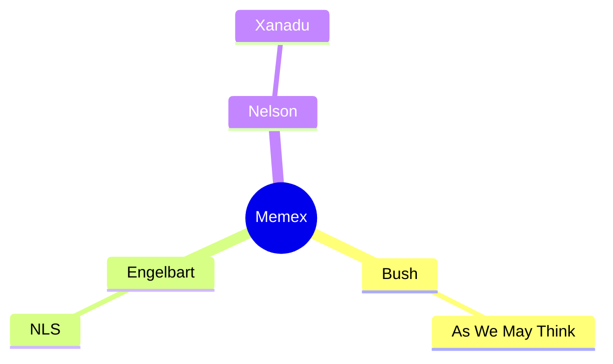

Lead.

<!-- BEGIN GENERATED plugin=mindmap scope_hash=a3f9c2 -->

## Mindmap

## Legend
- Bush: foundational vision
- Engelbart: hypertext systems
- Nelson: hyperlink cosmology

## Pages
- As We May Think → [[s1]]
- NLS → [[s2]]
- Xanadu → [[s3]]

## Evidence
> "A 1945 essay by Vannevar Bush proposing the memex" — [[s1]]
> "Engelbart's 1962 framework treating the augmentation" — [[s2]]
> "Ted Nelson's 1974 polemic introducing hypertext" — [[s3]]

<!-- END GENERATED -->
